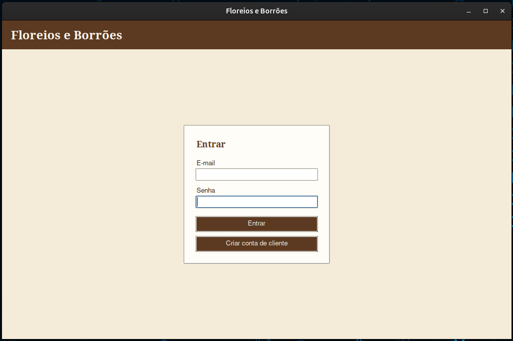
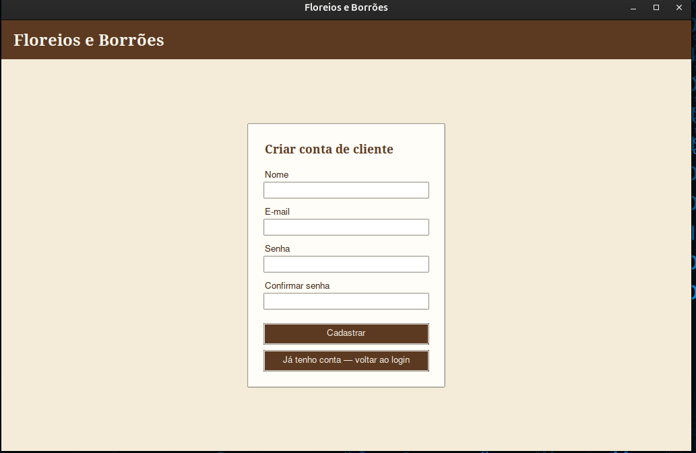
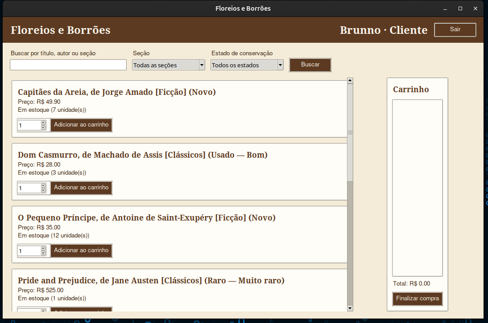
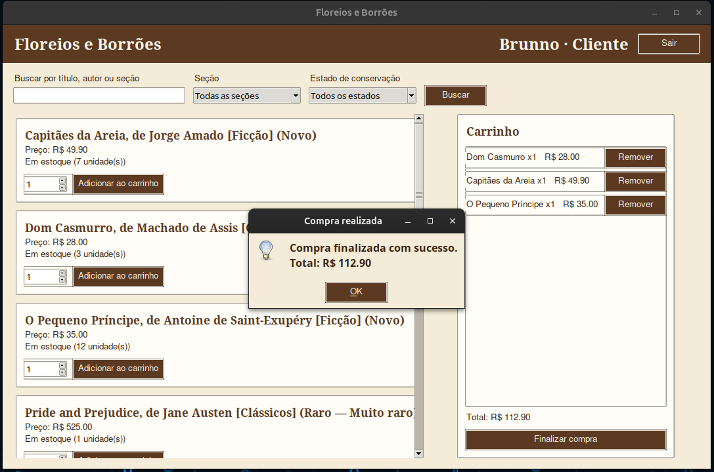
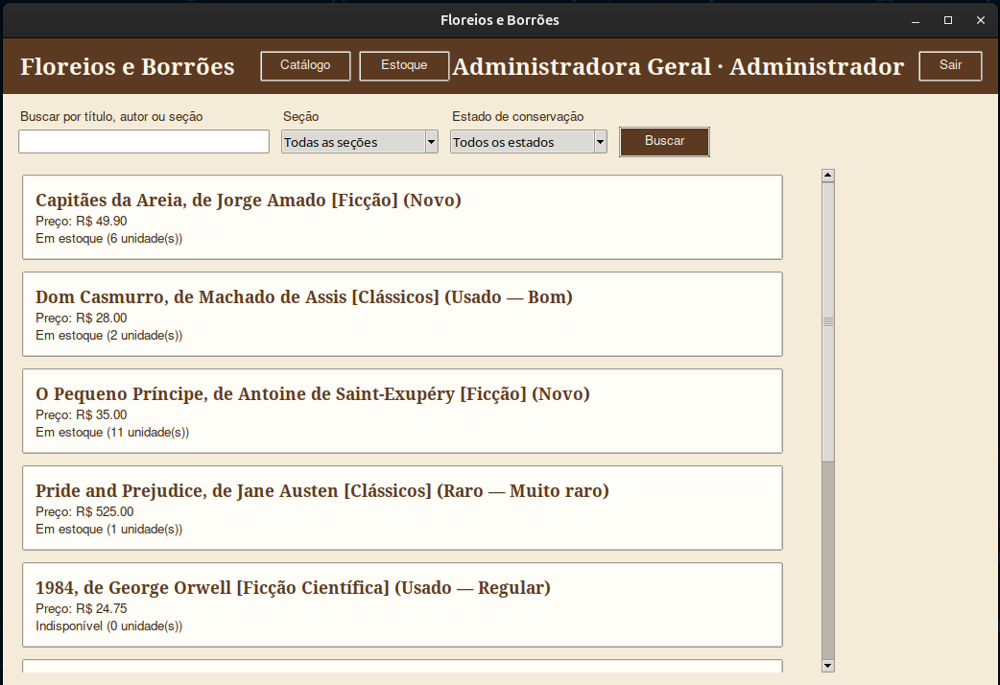
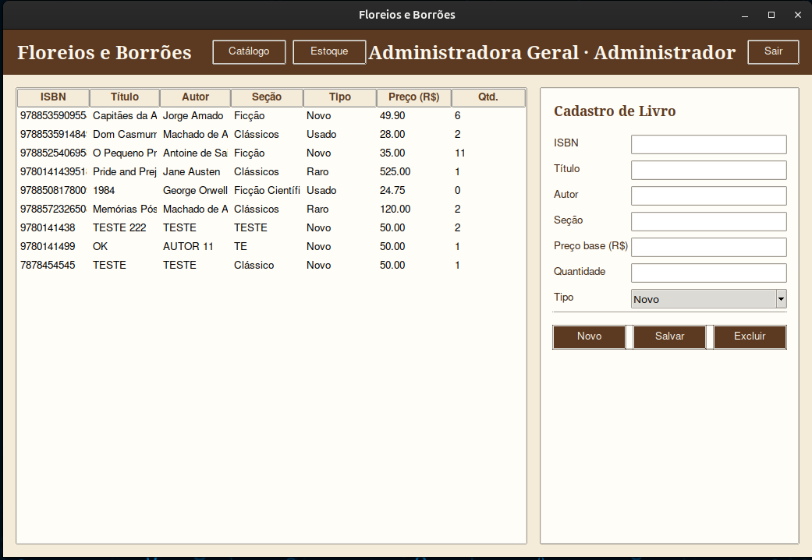

# Floreios e Borrões — Catálogo Digital

Aplicação desktop para a livraria **Floreios e Borrões**, permitindo que clientes consultem o acervo e a disponibilidade de títulos, montem um carrinho e finalizem a compra, e que administradores gerenciem o inventário (cadastro, edição e remoção de livros).

Trabalho de POO (G2) cobrindo os requisitos definidos em [`docs/G2Def.pdf`](docs/G2Def.pdf) conforme o enunciado em [`docs/trabalho-G2.pdf`](docs/trabalho-G2.pdf). Veja também a apresentação em [`docs/apresentacao.html`](docs/apresentacao.html).

## Equipe

| Nome | Papel |
|---|---|
| Anderson Rodrigues | Desenvolvimento |
| Brunno Colombo | Desenvolvimento |
| João Vitor Santos | Desenvolvimento |

---

## Stack

| Camada | Tecnologia |
|---|---|
| Linguagem | Python 3.12+ |
| Interface | Tkinter (biblioteca padrão — nenhuma dependência externa) |
| Persistência | Arquivos JSON (`floreios_e_borroes/dados/`) |
| Arquitetura | Camadas: `ui` → `servicos` → `dominio` ← `infra` |

Não há back-end web, banco de dados externo ou serviços de nuvem: a aplicação roda localmente como um programa desktop, e os dados são lidos/gravados diretamente em arquivos JSON.

---

## Como executar

Pré-requisito: Python 3.12+ (sem necessidade de `pip install`, pois só usa a biblioteca padrão).

```bash
python floreios_e_borroes/main.py
```

Isso abre a janela principal da aplicação (1024x640), carregando o acervo, os usuários e o histórico de vendas a partir dos arquivos em `floreios_e_borroes/dados/`.

### Credenciais de teste

Definidas em [`floreios_e_borroes/dados/usuarios.json`](floreios_e_borroes/dados/usuarios.json):

| Perfil | E-mail | Senha |
|---|---|---|
| Administrador | `admin@floreioseborroes.com.br` | `admin123` |
| Cliente | `cliente@exemplo.com` | `123456` |

Também é possível criar uma nova conta de cliente pela própria tela de login ("Criar conta de cliente").

---

## Funcionalidades

### Cliente
- Login e cadastro de conta
- Busca por título, autor ou seção
- Filtro por seção e por estado de conservação (livros usados)
- Catálogo com preço calculado conforme o tipo do livro e indicação de estoque em tempo real ("Em estoque (N unidade(s))" / "Indisponível")
- Carrinho de compras (adicionar/remover itens, total calculado)
- Checkout com baixa automática de estoque e confirmação da compra

### Administrador
- Painel de estoque com tabela completa do acervo (ISBN, título, autor, seção, tipo, preço, quantidade)
- CRUD completo de livros (cadastrar, editar, excluir)
- Suporte a três tipos de livro com regras de preço próprias: Novo, Usado (com depreciação por estado de conservação) e Raro (com ágio por grau de raridade)
- Acesso também à tela de Catálogo (mesma visão do cliente, sem carrinho), alternando pela barra de navegação

---

## Arquitetura e modelo de domínio

```
floreios_e_borroes/
├── dados/                          # Persistência em JSON
│   ├── acervo.json                 # Catálogo de livros
│   ├── usuarios.json                # Contas de cliente e administrador
│   └── caixa.json                   # Histórico de vendas
├── dominio/                         # Entidades de negócio
│   ├── item_acervo.py               # Livro (classe abstrata)
│   ├── livro_novo.py                # LivroNovo
│   ├── livro_usado.py               # LivroUsado + EstadoConservacao
│   ├── livro_raro.py                # LivroRaro + GrauRaridade
│   ├── usuario.py                    # Usuario (abstrata), Cliente, Administrador
│   └── venda.py                      # Venda, ItemVenda
├── infra/                           # Acesso a dados (repositórios JSON)
│   ├── repositorio_json.py
│   ├── repositorio_usuarios_json.py
│   └── repositorio_caixa_json.py
├── servicos/                         # Regras de negócio
│   ├── catalogo.py                   # Busca e filtros
│   ├── estoque.py                    # Inventário (adicionar/vender/remover)
│   ├── usuarios.py                   # Autenticação e cadastro
│   └── caixa.py                      # Finalização de venda
├── ui/
│   └── app_tkinter.py                # TelaLogin, TelaCadastro, TelaCliente, TelaAdministrador
└── main.py                           # Ponto de entrada
```

### Conceitos de orientação a objetos aplicados

| Conceito | Onde |
|---|---|
| Classe abstrata | `Livro` ([`item_acervo.py:5`](floreios_e_borroes/dominio/item_acervo.py)) e `Usuario` ([`usuario.py:5`](floreios_e_borroes/dominio/usuario.py)) |
| Herança | `LivroNovo`/`LivroUsado`/`LivroRaro` ← `Livro`; `Cliente`/`Administrador` ← `Usuario` |
| Polimorfismo | `calcular_preco()` e `descricao_catalogo()` com implementação própria em cada subclasse de `Livro`; `nivel_acesso()` em cada subclasse de `Usuario` |
| Sobrecarga de método | `Estoque.adicionar` ([`estoque.py:25-42`](floreios_e_borroes/servicos/estoque.py)), implementado com `@singledispatchmethod` para aceitar um `Livro` ou um ISBN (`str`) |
| Atributo privado | `Livro.__isbn` ([`item_acervo.py:15`](floreios_e_borroes/dominio/item_acervo.py)) |
| Método privado | `Livro.__validar_isbn` ([`item_acervo.py:26-31`](floreios_e_borroes/dominio/item_acervo.py)) |
| Programa principal | [`main.py`](floreios_e_borroes/main.py) instancia `Estoque`, `Catalogo`, `Usuarios`, `Caixa`, repositórios e `App` |

---

## Identidade visual

Estética de livraria clássica: tons de marrom (couro/madeira) e bege (papel antigo), tipografia serifada nos títulos e fonte limpa no corpo de texto, priorizando calmaria e legibilidade. Detalhes em [`docs/identidade-visual.md`](docs/identidade-visual.md).

---

## Telas do sistema

**Login**



**Criar conta de cliente**



**Catálogo — Cliente** (busca, filtros e carrinho)



**Checkout — Cliente** (finalização e confirmação da compra)



**Catálogo — Administrador**



**Estoque — Administrador** (CRUD de livros)



---

## Documentação adicional

- [`docs/requisitos.md`](docs/requisitos.md) — problema, ambiente de execução, perfis de usuário e requisitos funcionais
- [`docs/identidade-visual.md`](docs/identidade-visual.md) — paleta, tipografia e diretrizes visuais
- [`docs/G2Def.pdf`](docs/G2Def.pdf) — definição do projeto (entrega da Fase 1)
- [`docs/trabalho-G2.pdf`](docs/trabalho-G2.pdf) — enunciado e critérios de avaliação do trabalho
- [`docs/apresentacao.html`](docs/apresentacao.html) — apresentação (slides) do trabalho finalizado
